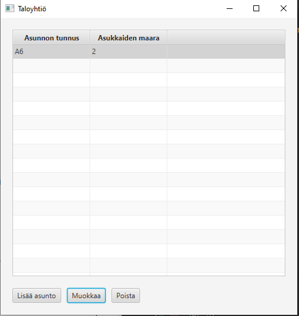
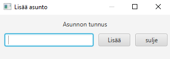
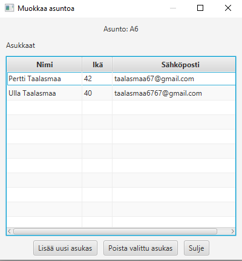
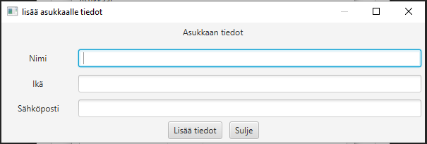

Huoneistotietojarjestelma

Toiminnallisuudet:
Sovelluksen idea on antaa taloyhtiön omistajalle mahdollisuus seurata oman taloyhtiön asuntoja ja
asuntojen tietoja sekä tallentaa niitä. Omistaja voi lisätä taloyhtiöön asunnoilleen tunnuksia ja poistaa niitä.
Lisäksi omistaja voi lisätä asuntoihin asukkaita sekä tarpeen tullessa poistaa asunnoista asukkaita.

Sovelluksen Käyttöliittymän ja näkymien toiminnot.
1. Pääikkuna

 

Lisää asunto toiminto: Nappia painettaessa aukeaa uusia ikkuna, jossa voidaan lisätä uuden asunnon tunnus 

Muokkaa toiminto: Valitaan hiiren vasemmalla napilla aluksi asunto, jota haluataan muokata. Jos 
muokattava asunto on valittuna, aukeaa asunnolle muokkaus ikkuna, jossa asunnon asukkaan tietoja voidaan muokata.

Poista toiminto: Poistaa hiiren vasemmalla napilla valitun asunnon ja sen asukkaat, kun nappia painetaan.

2. Lisää asunto ikkuna

Lisää toiminto: Syöttökentässä täytyy olla lisättävälle asunnolle tunnus, jotta toimii. Painamalla lisää näppäintä tai
Enter näppäintä yhtiöön lisätään annetulla tunnuksella uusi tyhjä asunto.

Sulje toiminto: Painettaessa sulkee Lisää asunto ikkunan

3. muokkaa asunto ikkuna: 

Lisää uusi asukas toiminto: Nappia painettaessa aukeaa uusia ikkuna, jossa voidaan lisätä uuden asukkaan tiedot.

Poista valittu asukas: Pitää olla valittuna poistettava asukas hiiren vasemmalla. Painettaessa poistaa asukkaan asunnostaan.

Sulje toiminto: Painettaessa sulkee muokkaa asuntoa ikkunan.

4. lisää asukkaalle tiedot ikkuna:

Lisää tiedot toiminto: Mikäli asukkaalle on annettu nimi, sähköposti ja ikä kokonaislukua 0-125, uusi asukas tietoineen lisätään asuntoon.

Sulje toiminto: Painettaessa sulkee lisää asukkaalle tiedot ikkunan.

